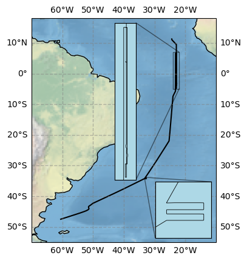
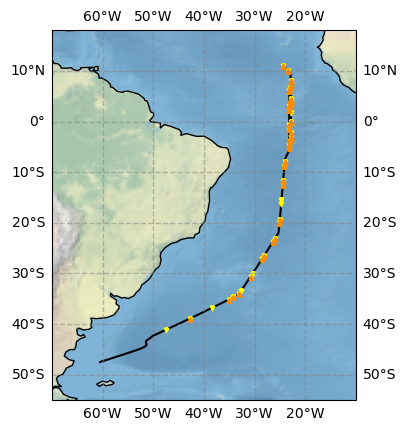
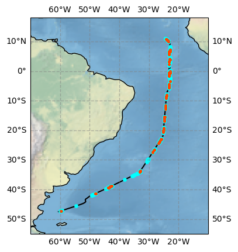
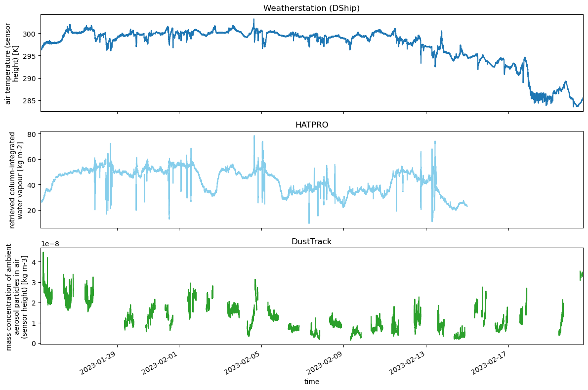
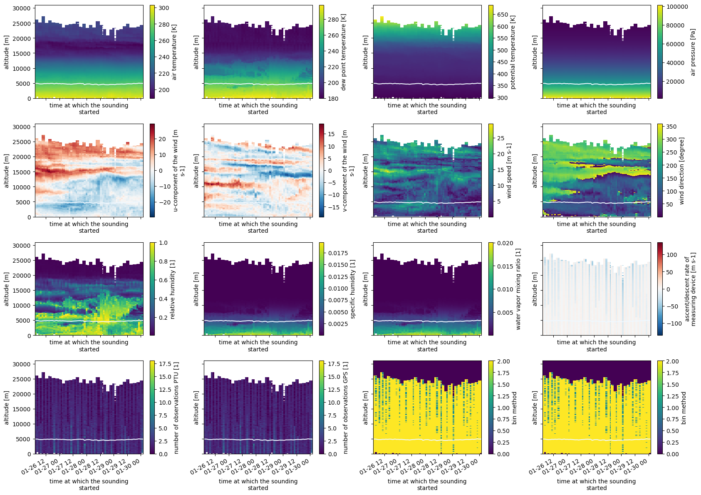
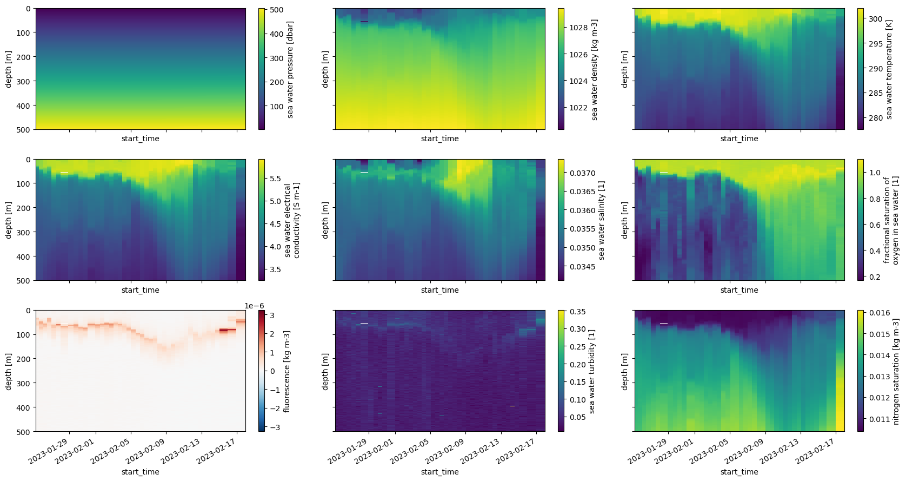
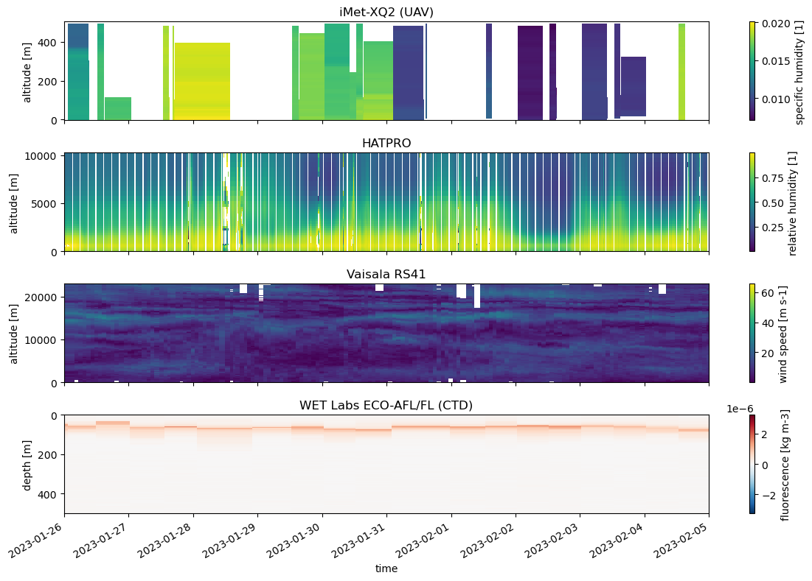

# ARC (MSM 114/2): Processing of atmospheric and oceanographic measurements
[](UPDATE)

This repository contains references to the atmospheric measurements and their post-processing steps of the cruise
*Atlantic references and tropical Convection* or short *ARC*. This cruise undertaken on RV Maria S. Merian has the identifier MSM 114/2.

The cruise started January 23, 2023 in Mindelo, Cape Verde and ended February 22, 2023 in Punta Arenas, Chile.

Further general information about the cruise can be found in the [cruise report](https://www.ldf.uni-hamburg.de/merian/wochenberichte/wochenberichte-merian/msm114-msm118/scr-msm-114-2.pdf). The data is described in detail in this [paper](UPDATE).

## Data sets

The data from the different instruments has been standardised with the [shipspy](https://github.com/shipspy-development/shipspy) package to simplify the comparison between different instruments as much as possible. For reprocessing the data, use the python environment from `environment.yaml` and run `reprocess.sh`.

### Cruise track


The continuous measurements (Ship integrated sensors, Ceilometer, DustTrack) except the HATPRO contain data of the time period from 2023-01-25 07:00 until 2023-02-20 15:00 shown in orange. The start point is at 11.29˚N and 24.39˚W, the end point is at 47.48˚S and 60.62˚W. Quality controlled HATPRO data is available until 2023-02-15 00:00. The positions of the point measurements (Radiosondes, HATPRO, CTD, Calitoo, Microtops) are shown below. The equator was crossed three times during the cruise to get three complete profiles of the ITCZ which are marked by the coordinate "section" in the data sets. Section 0 corresponds to the times before the first crossing, section 1, 2, 3 correspond to crossings 1, 2, 3, respectively, and section 4 is everything after the third crossing. The insets are zooms in the marked rectangular regions.

###  Positions of radiosonde launches and descents


In total, 93 radiosondes were launched. Light green triangles show the positions of the radiosonde launches, dark green triangles show the position where the descent starts.

### Positions of CTD and UAV 


Most of the time, CTDs were done twice a day (yellow triangles). When the (wind) conditions allowed for it, the UAVs were flown during the CTD times when the ship was not moving (orange triangles).

### Positions of Microtops and Calitoo


Calitoo (red dots) and Microtops (blue points) measurements where done during the whole complete when the weather and conditions allowed. Microtops data was post processed by [NASA Aeronet Maritim Aerosol Network (MAN)](https://aeronet.gsfc.nasa.gov/new_web/maritime_aerosol_network_v3.html). 

## Minimal plotting examples

### Continuous measurements

Plot data from various continuously measuring instruments.

```python
import xarray as xr
import matplotlib.pyplot as plt

dship = xr.open_dataset('arc_dship.nc')
hatpro = xr.open_dataset('arc_hatpro.nc')
dusttrak = xr.open_dataset('arc_dusttrak.nc')

fig, axs = plt.subplots(3,1,figsize=(12,8),sharex=True)

var_dict = {'dship': (dship, 't_air', axs[0], 'tab:blue'), 'hatpro': (hatpro, 'cwv', axs[1], 'skyblue'), 'dusttrak': (dusttrak, 'pm_all', axs[2], 'tab:green')}

for i in var_dict.keys():
    ds = var_dict[i][0]
    var = var_dict[i][1]
    a = var_dict[i][2]
    color = var_dict[i][3]
    ds[var].plot(ax = a, c = color)
    a.set_title(ds[var].attrs['instrument'])

for ax in axs:
    ax.set_xlim(dship.time.min(), dship.time.max())
    ax.set_xlabel('')
axs[2].set_xlabel('time')

plt.tight_layout()
plt.savefig("ARC_Cont_obs.png", bbox_inches="tight")
```


### Radio soundings level 2 for crossing 1

Plot level 2 radio soundings with freezing level (light blue line) for the first crossing if the ITCZ.

```python
import xarray as xr
import fsspec
import numpy as np
import matplotlib.pyplot as plt

crossing_number = 1

radio_level2 = xr.open_dataset('arc_radiosondes_level2.nc')
crossing = radio_level2.groupby('section')

freezing_alts = radio_level2.isel(alt = np.abs(radio_level2.t_air - 273.15).argmin(axis = 1)).alt

vars_to_plot = ['t_air', 'dp', 'theta', 'p_air', 'u_air', 'v_air', 'wspd', 'wdir', 'rh', 'q', 'mr', 'dz', 'N_ptu', 'N_gps', 'm_ptu', 'm_gps']

fig, axs = plt.subplots(4,4,figsize=(17,12),sharex=True, sharey=True)

for ax, var in zip(fig.get_axes(), vars_to_plot):
    ax.plot(radio_level2.start_time, freezing_alts, c = 'aliceblue')
    crossing[crossing_number][var].plot(x = 'start_time', ax = ax)
    
plt.tight_layout()
plt.savefig("ARC_RS_Level2_Crossing1.png", bbox_inches="tight")
```


### CTD

Plot CTD data up to 500 m depth. The deeper CTDs up to 3793 m were done during section 2 and 4.

```python
import xarray as xr
import fsspec
import numpy as np
import matplotlib.pyplot as plt

crossing_number = 1

ctd = xr.open_dataset('arc_ctd.nc')

vars_to_plot = ['p_sw', 'rho_sw', 't_sw', 'conductivity', 'salinity', 'oxygen', 'fluorescence', 'turbidity', 'nitrogen']

fig, axs = plt.subplots(4,4,figsize=(17,9),sharex=True, sharey=True)

for ax, var in zip(fig.get_axes(), vars_to_plot):
    ctd[var].sel(depth = slice(None,501)).plot(x = 'start_time', ax = ax)
    ax.set_ylim(500,0)
    
plt.tight_layout()
plt.savefig(f"plots/ARC_CTD_profiles.png", bbox_inches="tight")
```


### Profiles

Plot data from instruments measuring profiles for the 3 ITCZ crossings.

```python
import xarray as xr
import numpy as np
import matplotlib.pyplot as plt

radio = xr.open_dataset('arc_radiosondes_level2.nc')
hatpro = xr.open_dataset('arc_hatpro.nc')
uav = xr.open_dataset('arc_uav.nc')
ctd = xr.open_dataset('arc_ctd.nc')

fig, axs = plt.subplots(4, figsize=(12,8), sharex = True)

var_dict = {'uav': (uav, 'q', axs[0], 'start_time'), 'hatpro': (hatpro, 'rh', axs[1], 'time'), 'radio': (radio, 'wspd', axs[2], 'start_time'), 'ctd': (ctd, 'fluorescence', axs[3], 'start_time')}

for i in var_dict.keys():
    ds = var_dict[i][0]
    var = var_dict[i][1]
    a = var_dict[i][2]
    tname = var_dict[i][3]
    ds[var].plot(ax = a, x = tname)
    a.set_title(ds[var].attrs['instrument'])
axs[2].set_ylim(0,23000)
axs[3].set_ylim(500,0)
    
for ax in axs:
    ax.set_xlim(np.datetime64('2023-01-26'), np.datetime64('2023-02-05'))
    ax.set_xlabel('')
axs[3].set_xlabel('time')

plt.tight_layout()
plt.savefig("ARC_Profiles.png", bbox_inches="tight")
```

