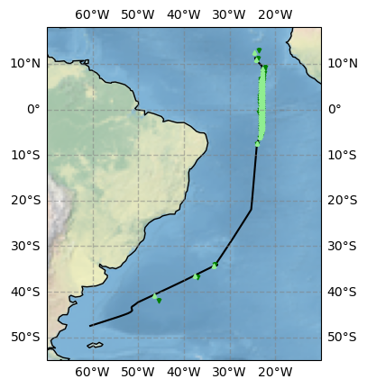

# Atmospheric measurements of ARC campaign (MSM 114/2)
[](UPDATE)

This repository contains references to the atmospheric measurements and their post-processing steps of the cruise
*Atlantic references and tropical Convection* or short *ARC*. This cruise undertaken on RV Maria S. Merian has the identifier MSM 114/2.

The cruise started January 23, 2023 in Mindelo, Cape Verde and ended February 22, 2023 in Punta Arenas, Chile.

Further general information about the cruise can be found in the [cruise report](https://www.ldf.uni-hamburg.de/merian/wochenberichte/wochenberichte-merian/msm114-msm118/scr-msm-114-2.pdf)

## Datasets

### Cruise track


The continuous measurements (Ship integrated sensors, HATPRO, Ceilometer, DustTrack) contain data of the time period from 2023-01-25 07:00 until 2023-02-20 15:00. The start point is at 11.29˚N and 24.39˚W, the end point is at 47.48˚S and 60.62˚W. In between, the equator was crossed three times to get three complete profiles of the ITCZ which are marked by the coordinate "section" in the datasets. Section 0 corresponds to the times before the first crossing, section 1, 2, 3 correspond to crossings 1, 2, 3, respectively, and section 4 is everything after the third crossing.

### Overview about sounding positions


In total, 93 radiosondes were launched. Light green dots show the positions of the radiosonde launches, dark green dots show the position where the descent starts.

### Overview about CTD and UAV positions


Most of the time, CTDs were done twice a day (yellow dots). When the (wind) conditions allowed for it, the UAVs were flown during the CTD times when the ship was not moving (red dots).

### Overview about Microtops positions


Microtops data was post processed by [NASA Aeronet Maritim Aerosol Network (MAN)](https://aeronet.gsfc.nasa.gov/new_web/maritime_aerosol_network_v3.html). 

### Overview about Calitoo positions


Calitoo measurements where done during the whole complete when the weather and conditions allowed.

## Minimal examples

### Continuous measurements

### Radio soundings level 2 for crossing 1

Plot level 2 radio soundings with freezing level (light blue line) for the first crossing if the ITCZ.

```python
import xarray as xr
import fsspec
import numpy as np
import matplotlib.pyplot as plt

crossing_number = 1

radio_level2 = xr.open_dataset('ARC_Radiosoundings_level2.nc')
crossing = radio_level2.groupby('section')

freezing_alts = radio_level2.isel(alt = np.abs(radio_level2.t_air - 273.15).argmin(axis = 1)).alt

vars_to_plot = ['t_air', 'dp', 'theta', 'p_air', 'u_air', 'v_air', 'wspd', 'wdir', 'rh', 'q', 'mr', 'dz', 'N_ptu', 'N_gps', 'm_ptu', 'm_gps']

fig, axs = plt.subplots(4,4,figsize=(17,12),sharex=True, sharey=True)

for ax, var in zip(fig.get_axes(), vars_to_plot):
    ax.plot(radio_level2.start_time, freezing_alts, c = 'aliceblue')
    crossing[crossing_number][var].plot(x = 'start_time', ax = ax)
    
plt.tight_layout()
plt.savefig("ARC_RS_Level2_Crossing1.png", bbox_inches="tight")
```


### UAV 

### CTD

Plot CTD data for the first crossing if the ITCZ up to 500 m depth. The deeper CTDs up to 3793 m were done during section 2 and 4.

```python
import xarray as xr
import fsspec
import numpy as np
import matplotlib.pyplot as plt

crossing_number = 1

ctd = xr.open_dataset('ARC_CTD.nc')
crossing = ctd.groupby('section')

vars_to_plot = ['p_sw', 'rho_sw', 't_sw', 'conductivity', 'salinity', 'oxygen', 'fluorescence', 'turbidity', 'nitrogen']

fig, axs = plt.subplots(4,4,figsize=(17,9),sharex=True, sharey=True)

for ax, var in zip(fig.get_axes(), vars_to_plot):
    crossing[crossing_number][var].plot(x = 'start_time', ax = ax)
    ax.set_ylim(500,0)
    
plt.tight_layout()
plt.savefig(f"ARC_RS_Level2_Crossing{crossing_number}.png", bbox_inches="tight")
```


### Calitoo and Microtops
